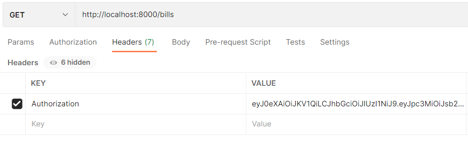

# Backend Server

---
Cài đặt :
```
Install xampp: https://www.apachefriends.org/download.html
Download source code : git clone https://github.com/dinhphu2k1-gif/Web-Technology-Project.git
Run backend server: php -S localhost:8000
```

## API
### 1. User:
- GET ```/users``` : lấy thông tin của tất cả người dùng (chỉ Admin)

VD: localhost:8000/users
- GET ```/users/:user_id``` : lấy thông tin của người dùng dựa trên id (chỉ Admin và chủ sở hữu)

VD: localhost:8000/users/1

- POST ```/users``` : tạo user mới

VD: 
- PUT ```/users/:user_id``` : cập nhật thông tin người dùng (chỉ Admin và chủ sở hữu)

VD: 
- DELETE ``/users/:user_id`` : xoá 1 user (chỉ Amin)

VD: 
- POST ```/users/sign_in``` : đăng nhập

VD: 

### 2. Admin
- GET ```/admins``` : lấy thông tin của tất cả admin

VD: 

- GET ```/admins/:admin_id```: lấy thông tin của 1 admin 

VD: 

- POST ```/admins``` : tạo admin mới (chỉ có admin mới có thể tạo 1 admin mới)

TK: admin MK: 123456

VD: 

- PUT ```/admins``` :cập nhật thông tin admin (tương tự như user)

- DELETE ```/admins/:admin_id``` : xoá admin

VD: 

- POST ```/admins/sign_in``` : đăng nhập

VD: 


### 3. Product
- GET ```/products``` : lấy thông tin của tất cả sản phẩm (API public nên ai cx dùng được)

VD: localhost:8000/products

- GET ```/products/:product_id``` : lấy thông tin 1 sản phẩm

VD: localhost:8000/products/1

- POST ```/products``` : tạo sản phẩm mới (chỉ Admin)

VD: 

- PUT ```/products/:product_id``` : cập nhật thông tin sản phẩm (chỉ Amin)

VD:  

- DELETE ```/products/:product_id``` : xoá sản phẩm (chỉ Admin)

VD: localhost:8000/products/1


### 4. CART
- GET ```/carts/:user_id``` : lấy thông tin sản phẩm trong giỏ hàng của người dùng

VD: 

- POST ```/carts/:user_id``` : thêm sản phẩm vào giỏ hàng

VD: 

- PUT ```/carts/:user_id/:id``` : cập nhật số lượng sp và tổng giá tiền

note: :id là id trong bảng cart_detail

VD: 

- DELETE ```//carts/:user_id/:id``` : xoá sản phẩm khỏi giỏ hàng

VD: 

### 5. Bill
- GET ```/bills``` : lấy thông tin các đơn hàng (chỉ Admin)

VD: 

- GET ```/bills/:user_id``` : lấy thông tin các đơn hàng (dành cho User)

VD: 

- POST ```/bills/:user_id``` : tạo hoá đơn 

VD: 

- DELETE ```/bills/:user_id/:bill_id``` : xoá đơn hàng
